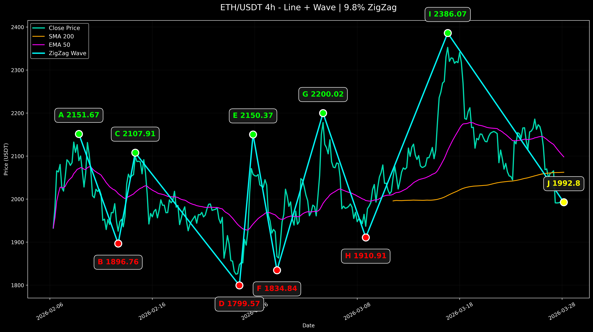
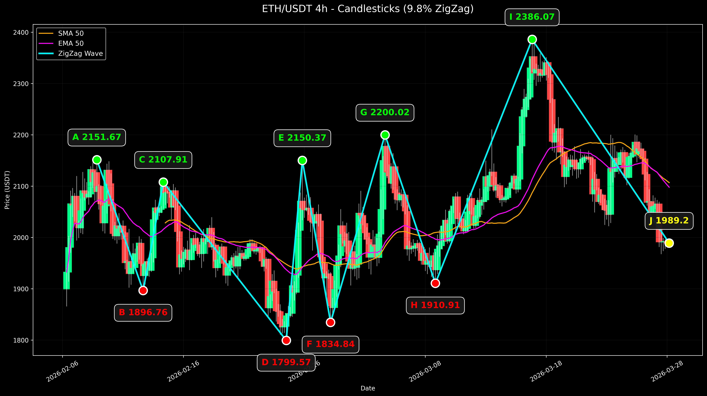
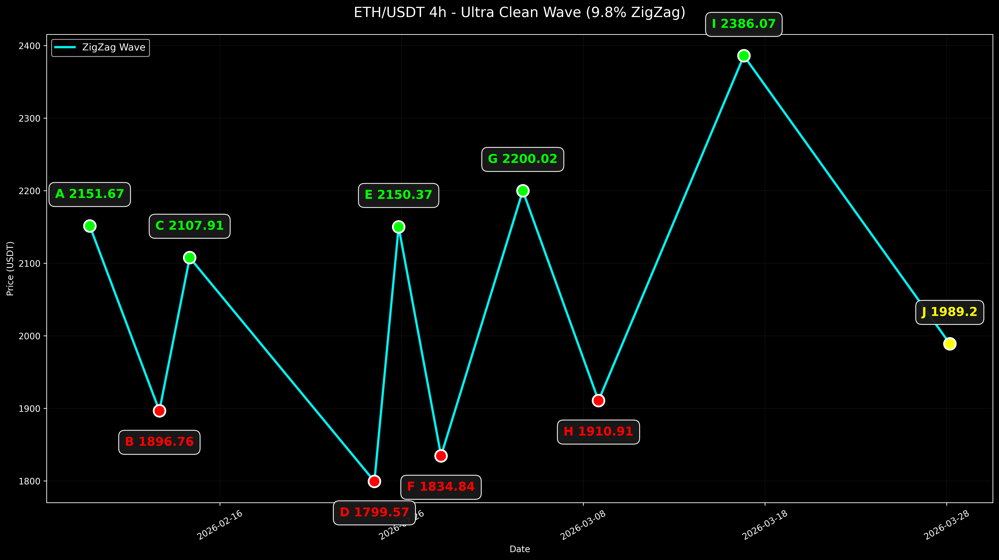

# 🌊 Crypto Waves

A lightweight CLI tool for visualizing crypto wave patterns. Plots ZigZag pivots over candlestick or line charts with SMA/EMA crossover detection and RSI analysis — all pulled live from Crypto.com via CCXT.

## Screenshots

**Line mode** — price line + SMA/EMA overlays + ZigZag wave


**Candles mode** — full candlestick chart + ZigZag wave


**Wave mode** — ultra-clean ZigZag only, no noise


## Installation

```bash
pip install -r requirements.txt
```

Or install as a command (adds a `waves` command to your PATH):

```bash
pip install .
```

## Usage

```
waves [--symbol SYMBOL] [--timeframe TIMEFRAME] [--deviation DEVIATION]
      [--limit LIMIT] [--mode {line,candles,wave}] [--save-only] [-v]
```

### Options

| Flag | Default | Description |
|---|---|---|
| `--symbol` | `ETH/USDT` | Trading pair |
| `--timeframe` | `4h` | Candle interval (`1h`, `4h`, `1d`, …) |
| `--deviation` | `9.8` | ZigZag pivot sensitivity (%) |
| `--limit` | `300` | Number of candles to fetch |
| `--sma` | `50` | SMA period |
| `--ema` | `50` | EMA period |
| `--mode` | `line` | Chart style: `line`, `candles`, or `wave` |
| `--text-only` | off | Print terminal analysis only, skip chart |
| `--save-only` | off | Save PNG without opening a window |
| `-v / --version` | — | Print version and exit |

### Examples

```bash
# Default — ETH/USDT 4h line chart
waves

# Bitcoin daily candlesticks
waves --symbol BTC/USDT --timeframe 1d --mode candles

# Ultra-clean wave-only view, no window popup
waves --symbol SOL/USDT --timeframe 1h --mode wave --save-only

# Tighter ZigZag (more pivot points)
waves --deviation 5 --timeframe 1h
```

## Output

```
Fetching 300 4h candles for ETH/USDT...


=== ETH/USDT 4h ANALYSIS ===
Current Date      : 2026-03-28 04:00
Current Price     : $1992.80
RSI 14            : 10.6
SMA 200           : $2062.52
EMA 50            : $2098.30
Crossover Status  : BEARISH CROSSOVER on 2026-02-06 08:00 @ $1932.77

ZigZag Deviation  : 9.8% → 10 points

WAVE POINTS:
A  →    2151.67 (HIGH   )
B  →    1896.76 (LOW    )
C  →    2107.91 (HIGH   )
D  →    1799.57 (LOW    )
E  →    2150.37 (HIGH   )
F  →    1834.84 (LOW    )
G  →    2200.02 (HIGH   )
H  →    1910.91 (LOW    )
I  →    2386.07 (HIGH   )
J  →     1992.8 (CURRENT)

AI One-liner:
ETH/USDT 4h wave: A=2151.67 → B=1896.76 → C=2107.91 → D=1799.57 → E=2150.37 → F=1834.84 → G=2200.02 → H=1910.91 → I=2386.07 → J=1992.8

✅ Chart saved as: ETH_USDT_4h_line.png
```

## Requirements

- Python 3.10+
- `ccxt`, `pandas`, `matplotlib`

Data is fetched from Crypto.com's public OHLCV endpoint — **no API key required**.
